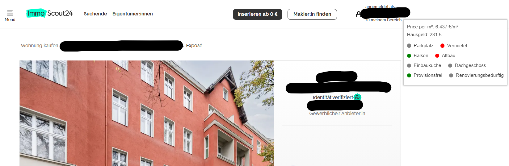

# immoscoutChromeExtension

This Chrome extension adds a small popup to Immobilienscout24 expose pages, displaying light indicators for various property features. The indicators are color-coded: green for desirable features (e.g., parking, balcony) and red for potentially undesirable ones (e.g., rented, old building, in need of renovation). It also shows additional information like price per square meter and "Hausgeld".

## Features

* **Real-time Indicators:** Dynamically analyzes the current Immobilienscout24 page and shows indicators for:
    * **Parking availability:** Checks for keywords like "Garage," "Stellplatz," or "Parkplatz" in the title, description, garage label, garage value, and equipment sections.
    * **Balcony:** Checks for the presence of a balcony element on the page.
    * **Fitted kitchen:** Checks for the presence of a fitted kitchen element on the page.
    * **No commission ("Provisionsfrei"):**  Looks for mentions of "Maklerprovision" and verifies if the listed commission is 0€.
    * **Rented status:** Looks for keywords like "Kapitalanlage," "Geldanlage," "Immobilienanlage," "vermietet," "Mietverhältnis," or "Mieteinnahmen" in the title and description.
    * **Old building ("Altbau"):** Checks for the keyword "Altbau" in the title and description.
    * **Top floor apartment ("Dachgeschoss"):** Checks for the keyword "Dachgeschoss" or "Dach" in the title, description, and the "Typ" element.
    * **In need of renovation ("Renovierungsbedürftig"):** Checks for keywords like "renovierungsbedürftig" or "renovierungsbeduerftig" in the "Objektzustand" element.
* **Additional Information:** Displays price per square meter and "Hausgeld".
* **Golden Notification:** If all positive indicators are present and all negative indicators are absent, the page title gets a 🌟 and the favicon becomes gold.
* **Non-intrusive:** The popup is small and positioned out of the way.

## Installation

1. Clone this repository.
2. Open Chrome and go to `chrome://extensions/`.
3. Enable "Developer mode" in the top right corner.
4. Click "Load unpacked".
5. Select the directory where you cloned the repository.

## Usage

Navigate to any Immobilienscout24 expose page. The extension will automatically analyze the page and display the light indicators in a popup.

## Contributing

Contributions are welcome! Please open an issue or submit a pull request.

## License

MIT License

## Disclaimer

This extension is not affiliated with Immobilienscout24. It is an independent project. The accuracy of the information displayed is not guaranteed. Use at your own risk.
